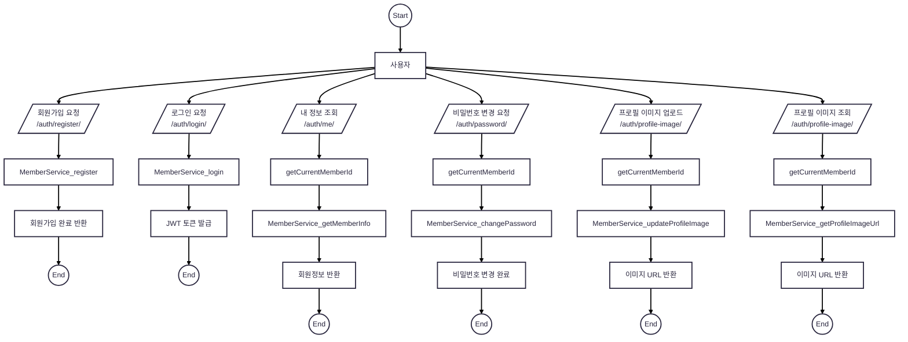

```mermaid
---
config:
      theme: redux
---
flowchart TD
  start((Start)) --> user["사용자"]

  %% 회원가입
  user --> regInput[/회원가입 요청<br>/auth/register/ /]
  regInput --> regSvc["MemberService_register"]
  regSvc --> regResp["회원가입 완료 반환"]
  regResp --> end1((End))

  %% 로그인
  user --> loginInput[/로그인 요청<br>/auth/login/ /]
  loginInput --> loginSvc["MemberService_login"]
  loginSvc --> jwt["JWT 토큰 발급"]
  jwt --> end2((End))

  %% 내 정보 조회
  user --> meInput[/내 정보 조회<br>/auth/me/ /]
  meInput --> getId1["getCurrentMemberId"]
  getId1 --> getInfo["MemberService_getMemberInfo"]
  getInfo --> infoResp["회원정보 반환"]
  infoResp --> end3((End))

  %% 비밀번호 변경
  user --> pwInput[/비밀번호 변경 요청<br>/auth/password/ /]
  pwInput --> getId2["getCurrentMemberId"]
  getId2 --> pwSvc["MemberService_changePassword"]
  pwSvc --> pwResp["비밀번호 변경 완료"]
  pwResp --> end4((End))

  %% 프로필 이미지 업로드
  user --> upInput[/프로필 이미지 업로드<br>/auth/profile-image/ /]
  upInput --> getId3["getCurrentMemberId"]
  getId3 --> upSvc["MemberService_updateProfileImage"]
  upSvc --> imgUrl["이미지 URL 반환"]
  imgUrl --> end5((End))

  %% 프로필 이미지 조회
  user --> viewInput[/프로필 이미지 조회<br>/auth/profile-image/ /]
  viewInput --> getId4["getCurrentMemberId"]
  getId4 --> getImg["MemberService_getProfileImageUrl"]
  getImg --> imgResp["이미지 URL 반환"]
  imgResp --> end6((End))
```