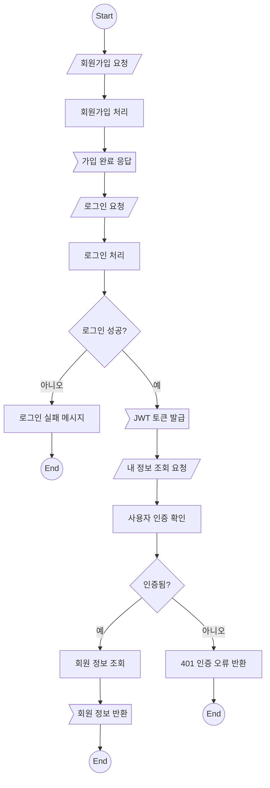

```mermaid
flowchart TD
    start((Start))

%% 회원가입 흐름
    start --> regReq[/회원가입 요청/]
    regReq --> regProc[회원가입 처리]
    regProc --> regResp>가입 완료 응답]
    regResp --> loginReq[/로그인 요청/]

%% 로그인 흐름
    loginReq --> loginProc[로그인 처리]
    loginProc --> loginSuccess{로그인 성공?}
    loginSuccess -- 예 --> jwt>JWT 토큰 발급]
    loginSuccess -- 아니오 --> loginFail[로그인 실패 메시지]
    loginFail --> end1((End))
    jwt --> meReq[/내 정보 조회 요청/]

%% 내 정보 조회 흐름
    meReq --> authCheck[사용자 인증 확인]
    authCheck --> isAuthed{인증됨?}
    isAuthed -- 예 --> infoQuery[회원 정보 조회]
    infoQuery --> infoResp>회원 정보 반환]
    infoResp --> end2((End))

    isAuthed -- 아니오 --> authFail[401 인증 오류 반환]
    authFail --> end3((End))
```